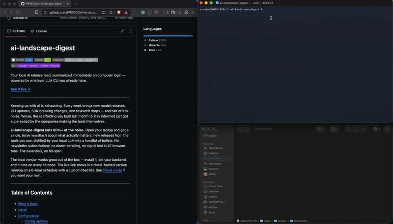
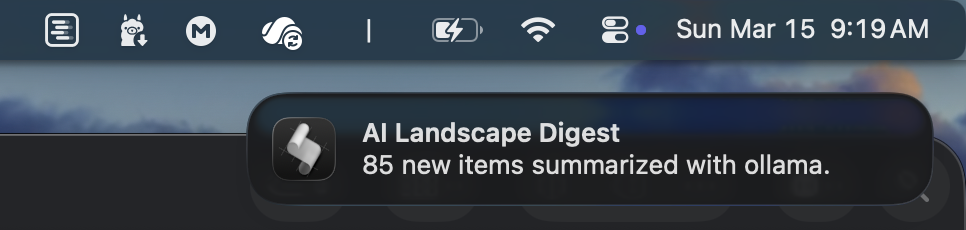

# ai-landscape-digest

   

Your local AI release feed, summarized immediately on computer login — powered by whatever LLM CLI you already have.

**[See it live →](https://procko.pro/ai-landscape-digest)**

---



---

Keeping up with AI is exhausting. Every week brings new model releases, CLI updates, SDK breaking changes, and research drops — and half of it is noise. Worse, the scaffolding you built last month to stay informed just got superseded by the companies making the tools themselves.

**ai-landscape-digest cuts 90%+ of the noise.** Open your laptop and get a single, terse newsflash about what actually matters: new releases from the tools you use, distilled by your local LLM into a handful of bullets. No newsletter subscriptions, no doom-scrolling, no signal lost in 47 browser tabs. The essentials, on lid open.

The local version works great out of the box — install it, set your backend, and it runs on every lid open. The live link above is a cloud-hosted version running on a 6-hour schedule with a custom feed list. See [Cloud mode](#cloud-mode-optional) if you want your own.

---

## Table of Contents

- [What it does](#what-it-does)
- [Install](#install)
- [Configuration](#configuration)
  - [Config options](#config-options)
  - [How backends work](#how-backends-work)
  - [Switching backends](#switching-backends)
  - [Ollama recommended models](#ollama-recommended-models)
- [Feeds](#feeds)
  - [Default feeds](#default-feeds)
  - [Custom feeds](#custom-feeds)
- [Running](#running)
  - [Commands](#commands)
  - [Flags](#flags)
- [Scheduling & triggers](#scheduling--triggers)
- [Cloud mode *(optional)*](#cloud-mode-optional)
- [Workspace](#workspace)
- [Testing](#testing)
- [File reference](#file-reference)
- [License](#license)

---

## What it does

Fetches RSS feeds from AI tools and research sources, deduplicates against what you've already seen, pipes the new stuff to your LLM CLI, and prints a terse digest. Runs automatically on lid open and on a configurable background timer. No cloud accounts, no separate API keys — uses the CLI you already have.

Every run produces a full **HTML summary that automatically opens in your browser** — a clean, readable report of everything new, saved to `~/Documents/`. You also get a desktop notification so you know it ran.

Here's what you'll see:

<p align="center">
  
  
</p>

## Install

```bash
git clone https://github.com/PR0CK0/ai-landscape-digest
cd ai-landscape-digest
pip install -r requirements.txt
python3 -m ai_digest install-trigger
```

That's it. Close and reopen your lid — it runs, opens the HTML report in your browser, and sends a desktop notification. Or `make run` to run immediately.

> If you don't have `make`, `python3 -m ai_digest` is equivalent to `make run`.

> **macOS:** On first run, macOS will show permission prompts to allow file access (for writing the local HTML report to `~/Documents/` and reading config files). Accept these — the app won't work without them. You can review granted permissions any time under **System Settings → Privacy & Security → Files and Folders**.

## Configuration

Copy `config.example.yaml` to `config.yaml` and set your backend. That's the only required change — everything else has a sensible default.

```bash
cp config.example.yaml config.yaml
# edit config.yaml and set: backend: claude  (or gemini, codex, ollama)
```

`config.yaml` is gitignored and stays local to your machine. The full annotated reference is in `config.example.yaml`.

### Config options

| Setting | Default | Description |
|---|---|---|
| `backend` | **required** | LLM CLI to use: `claude`, `gemini`, `codex`, or `ollama` |
| `model` | `default` | Model passed to the CLI — `default` lets each CLI choose |
| `output` | `terminal` | `terminal` prints only; `github_pages` writes `docs/` for GitHub Pages deployment |
| `html_output` | `true` | Generate a local HTML report in `~/Documents/ai-landscape-digest/` |
| `include_defaults` | `true` | Include the built-in feed list |
| `custom_feeds` | `[]` | Additional RSS/Atom feeds (see [Custom feeds](#custom-feeds)) |
| `check_interval` | `3600` | Seconds between auto-runs; `0` = lid-open only, no throttle or timer |
| `seen_ttl_days` | `30` | Days before a seen item ID expires and can surface again |
| `timezone` | *(system)* | Timezone for digest timestamps, e.g. `America/New_York` |
| `verbose` | `false` | Print per-feed fetch counts to stderr |
| `prompt` | *(built-in)* | Override the LLM summarization prompt |

### How backends work

ai-landscape-digest doesn't handle API keys or authentication itself. It calls your LLM CLI as a subprocess — the same tool you'd type at the terminal. If `claude` (or `gemini`, `codex`) is already installed and authenticated on your machine, it works immediately. No extra setup, no secrets in config files.

Each CLI handles auth its own way:

| Backend | Install | Auth |
|---|---|---|
| `claude` | `npm install -g @anthropic-ai/claude-code` | `claude` (interactive login on first run) |
| `gemini` | `npm install -g @google/gemini-cli` | `gemini` (Google account login on first run) |
| `codex` | `npm install -g @openai/codex` | Set `OPENAI_API_KEY` env var |
| `ollama` | [ollama.com](https://ollama.com) | No auth — fully local |

Once authenticated, `doctor` verifies the CLI is on your PATH:

```bash
python3 -m ai_digest doctor
```

### Switching backends

```yaml
# Claude — uses your existing Claude Code subscription
# Recommended: explicitly set the cheapest/fastest model (haiku variant)
# Run `claude --help` to see current model names
backend: claude
model: default

# Gemini CLI
backend: gemini
model: gemini-2.5-flash

# OpenAI Codex CLI
backend: codex
model: gpt-4o-mini

# Ollama — fully local, no API key or subscription needed
backend: ollama
model: ministral-3:3b    # see recommended models below
```

### Ollama recommended models

Ollama runs entirely on your machine — no API key, no usage costs, works offline.

```bash
ollama pull ministral-3:3b
```

**`ministral-3:3b` is the recommended model** — consistent ~4s, clean grouped output, no hallucinations, no prompt leakage. This is what the project is tuned and tested against.

Other tested models, for reference:

| Model | Median | Notes |
|---|---|---|
| `ministral-3:3b` | ~4s | **recommended** — best quality, consistent |
| `smollm2:1.7b` | ~4s | decent flat output, occasional timeouts |
| `gemma3:1b` | ~4s | fast but ignores prompt formatting |
| `llama3.2:1b` | ~2s | fast but high variance (1–9s), over-lists versions |
| `qwen2.5:1.5b` | ~3s | over-formatted, repeats sections |
| `qwen3.x` | 170s+ | thinking models — do not use |

> Avoid any `qwen3.x` model — they leak chain-of-thought and are unusably slow for this use case.

## Feeds

### Default feeds

| Source | Type |
|---|---|
| Claude Code | GitHub releases |
| Codex CLI | GitHub releases |
| Gemini CLI | GitHub releases |
| Aider | GitHub releases |
| Ollama | GitHub releases |
| Anthropic SDK (Python) | GitHub releases |
| OpenAI SDK (Python) | GitHub releases |
| OpenAI Blog | RSS |
| Hugging Face Blog | RSS |
| Last Week in AI | Newsletter RSS |
| Latent Space | Newsletter RSS |

Set `include_defaults: false` to use only your `custom_feeds`.

### Custom feeds

Any RSS or Atom feed URL works. The `name` field becomes the source label in the digest.

```yaml
custom_feeds:
  # Blogs & newsletters
  - name: "Simon Willison"
    url: "https://simonwillison.net/atom/everything/"
  - name: "The Batch (DeepLearning.AI)"
    url: "https://www.deeplearning.ai/the-batch/feed/"
  - name: "Interconnects"
    url: "https://www.interconnects.ai/feed"
  - name: "Ahead of AI"
    url: "https://magazine.sebastianraschka.com/feed"

  # GitHub releases — every public repo exposes this automatically, no token needed
  # Format: https://github.com/OWNER/REPO/releases.atom
  - name: "LangChain"
    url: "https://github.com/langchain-ai/langchain/releases.atom"
  - name: "vLLM"
    url: "https://github.com/vllm-project/vllm/releases.atom"

  # Hacker News — filter by keyword + minimum points for signal quality
  - name: "Hacker News — LLMs"
    url: "https://hnrss.org/newest?q=LLM+OR+claude+OR+openai&count=15"
  - name: "Hacker News — AI (50+ pts)"
    url: "https://hnrss.org/newest?q=artificial+intelligence&points=50&count=10"

  # Company blogs
  - name: "Anthropic"
    url: "https://www.anthropic.com/rss.xml"
  - name: "Google DeepMind"
    url: "https://deepmind.google/blog/rss/"

  # Research preprints
  - name: "arXiv CS.AI"
    url: "https://arxiv.org/rss/cs.AI"
```

## Running

### Commands

| Command | Description |
|---|---|
| `make run` | Run digest immediately |
| `python3 -m ai_digest` | Same via package entrypoint |
| `python3 -m ai_digest install-trigger` | Install platform wake + timer trigger |
| `python3 -m ai_digest uninstall-trigger` | Remove platform triggers |
| `python3 -m ai_digest doctor` | Check environment and installed triggers |
| `make reset` | Clear dedup cache (next run shows last 7 days) |
| `python3 -m ai_digest purge` | Remove all triggers, state files, and output — full uninstall |
| `make test` | Run unit tests |
| `make test-integration` | Run integration tests (requires network) |

### Flags

| Flag | Default | Description |
|---|---|---|
| `--trigger TRIGGER` | `manual` | Override trigger label: `wake`, `manual`, `automatic`, `github_actions` |
| `--config PATH` | auto | Path to a specific `config.yaml` |
| `--force` | off | Ignore `seen_items.json` and re-process all fetched items |
| `--no-notify` | off | Disable desktop notifications for this run |

## Scheduling & triggers

`install-trigger` sets up two things on your machine:

| Platform | Wake on lid open | Background timer |
|---|---|---|
| macOS | `sleepwatcher` → `~/.wakeup` | `launchd` agent (`~/Library/LaunchAgents/com.ai-landscape-digest.plist`) |
| Linux | — | `systemd --user` timer |
| Windows | — | Task Scheduler with repetition trigger |

**Two-layer design:** the platform fires the trigger, and a Python-layer throttle gates the actual run. Even if you open and close your lid repeatedly, the digest only runs once per `check_interval` seconds.

Control the schedule with `check_interval` in `config.yaml`:

| Value | Behavior |
|---|---|
| `1800` | Run on wake + timer every 30 minutes |
| `3600` | Run on wake + timer every hour *(default)* |
| `7200` | Run on wake + timer every 2 hours |
| `86400` | Run on wake + timer once a day |
| `0` | Run on every lid open, no throttle, no background timer |

**After changing `check_interval`, re-run `install-trigger`** to update the platform timer. The throttle picks up the new value immediately, but `launchd`/`systemd`/Task Scheduler must be regenerated:

```bash
python3 -m ai_digest install-trigger
```

## Cloud mode *(optional)*

Want the digest to run automatically in the cloud and be accessible from anywhere? See [CLOUD_MODE.md](CLOUD_MODE.md).

## Workspace

Config and state files live next to `config.yaml`. The default is the repo root. Pass `--config PATH` to point at a config file elsewhere — all state (`seen_items.json`, `.last_fetch_at`) follows it to that directory.

## Testing

```bash
# Unit tests — fast, no network, no LLM
make test

# Integration tests — hits real feed URLs
make test-integration

# Everything
pytest
```

## File reference

```
ai_digest/
  app.py             application core, pipeline, HTML generation
  __main__.py        python3 -m ai_digest entrypoint
  cli.py             argument parsing
  constants.py       file paths and timing defaults
  feeds.py           built-in feed list
  prompts.py         default summarization prompt
  settings.py        config loading and AppConfig dataclass
  paths.py           platform-aware file path helpers
  doctor.py          environment diagnostics (make doctor)
  installers.py      platform trigger install/uninstall + script templates
  adapters/
    notifiers.py     desktop notification adapters (macOS, null)
    triggers.py      trigger lifecycle — wake, timer, manual behaviors
config.yaml          your local config (gitignored)
config.example.yaml  full config reference with every option documented
seen_items.json      dedup state — tracks seen item IDs with timestamps
requirements.txt     Python dependencies
Makefile             convenience commands
tests/
  test_unit.py       unit tests (mocked — fast, no network)
  test_integration.py  integration tests (real feeds, real filesystem)
.github/
  workflows/
    digest.yml       GitHub Actions scheduled runner
```

## License

MIT — free to use, modify, and distribute. See [LICENSE](LICENSE).

Conceived and directed by [PR0CK0](https://github.com/PR0CK0). Programmed with [Claude Code](https://claude.ai/code), [Gemini CLI](https://github.com/google-gemini/gemini-cli), and [Codex CLI](https://github.com/openai/codex).
